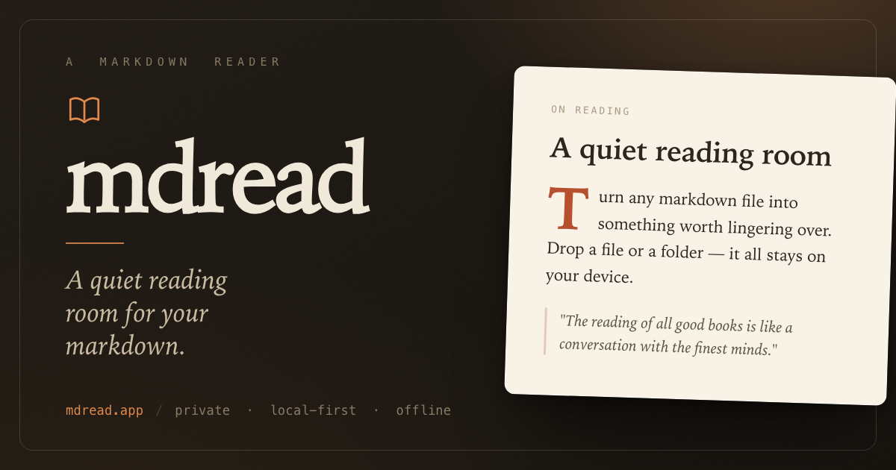

# mdread

**A quiet reading room for your markdown.** Drop a file or a whole folder, read it
beautifully, edit it in place, and download it — all in the browser. Local-first:
your files never leave your device. Deploys to Cloudflare in one command.

🔗 **Live: [mdread.app](https://mdread.app)** · MIT licensed · no backend · no tracking

[](https://deploy.workers.cloudflare.com/?url=https://github.com/techjewel/mdread)



## What it does

- 📂 **Open a folder or files** — via the native file picker, or just **drag & drop**
  anything onto the page (a single `.md`, a stack of files, or an entire folder tree).
- 📖 **Read** — typography tuned for hours of long-form reading, using your OS's
  native reading serif (New York on Apple, Georgia elsewhere — no web fonts to
  download): comfortable measure and leading, oldstyle figures, a table of contents
  with scroll-spy, and a reading-progress bar.
- ✍️ **Edit** — Read / Split / Edit views. On Chrome & Edge, **Save writes straight
  back to the original file on disk** (File System Access API). Elsewhere it downloads.
- ⬇️ **Download** any document as a clean `.md`.
- 🎨 **Day / Sepia / Night** themes, adjustable text size, line width, typeface, and
  an optional drop cap.
- 🔌 **Offline** — installable PWA; the app shell is cached, so it works with no network.
- 🧠 **Remembers** your last folder, your last document, your reading position, and your
  preferences across visits.

Everything runs client-side with three small markdown libraries
([marked](https://marked.js.org), [DOMPurify](https://github.com/cure53/DOMPurify),
[highlight.js](https://highlightjs.org)) bundled and self-hosted, and **system fonts
only** — no external requests at runtime.

## Develop locally

```bash
npm install
npm run dev          # Vite dev server with hot reload → http://localhost:5173
```

Edit anything under `src/` and the page reloads. To check a production build the
way it's actually deployed:

```bash
npm run build        # bundles + compiles SCSS into ./dist
npm run preview      # serves ./dist → http://localhost:4173
```

> **Note on editing:** live "save to disk" needs the File System Access API
> (Chrome/Edge, and over `http://localhost` or HTTPS). In other browsers files open
> read-only and edits download as new files. Reading works everywhere.

## Deploy to Cloudflare

### One-click (no CLI)

[](https://deploy.workers.cloudflare.com/?url=https://github.com/techjewel/mdread)

Cloudflare clones this repo into your own GitHub, runs `npm run build`, and deploys
to a free `*.workers.dev` URL on your account. Every push to your copy then
auto-builds and deploys via Workers Builds. (The `mdread.app` custom domain lives in
the `production` environment, which the button doesn't use — you get your own URL.)

### From the CLI

Both paths below build first, then publish `./dist`.

#### Workers (recommended, uses `wrangler.jsonc`)

```bash
npm install
npx wrangler login   # or set CLOUDFLARE_ACCOUNT_ID for non-interactive / CI deploys
npm run deploy       # → a free *.workers.dev URL (what a fork gets out of the box)
npm run deploy:prod  # → your custom domain (uses the `production` env in wrangler.jsonc)
```

`wrangler.jsonc` doesn't hardcode an account or domain: the account comes from
`wrangler login` (or `CLOUDFLARE_ACCOUNT_ID`). The base config publishes to
`*.workers.dev`; the `env.production` block carries the custom domain, so
`deploy:prod` is the one that goes live on a real domain. To use your own domain,
change `name` and the `pattern` under `env.production.routes`.

#### Cloudflare Pages

```bash
npm run build
npx wrangler pages deploy dist --project-name markread
# or: npm run deploy:pages
```

…or in the Cloudflare dashboard: **Pages → Create → Connect/Direct upload**. Build
command `npm run build`, output directory `dist`.

## Keyboard shortcuts

| Key | Action |
| --- | --- |
| `⌘/Ctrl + O` | Open folder |
| `⌘/Ctrl + S` | Save (to disk, or download) |
| `⌘/Ctrl + E` | Toggle edit |
| `⌘/Ctrl + \` | Toggle sidebar |
| `t` | Toggle table of contents |
| `f` | Focus mode |
| `/` | Search files |
| `Esc` | Exit focus / close popover |

## Project layout

```
index.html            app shell (Vite entry)
src/
  main.js             entry: imports styles, wires the UI, boots the app
  modules/            one concern per file — files, tree, document, editor,
                      save, markdown, recents, scroll, view, ui, keyboard, …
  styles/             SCSS partials assembled by main.scss (themes, typography, layout)
public/               static assets copied verbatim: icons, manifest, og-image
vite.config.js        build + PWA service-worker config
wrangler.jsonc        Cloudflare Workers Assets config (serves ./dist)
```

No framework — plain ES modules and SCSS. The service worker is generated by
`vite-plugin-pwa`. See [`CLAUDE.md`](CLAUDE.md) for an architecture tour and
[`CONTRIBUTING.md`](CONTRIBUTING.md) to get started.

## Privacy

There is no server, no analytics, and **no external requests at runtime** — not
even web fonts (the app uses your operating system's native fonts). Files are read
in your browser; the only persistence is local (IndexedDB stores folder handles so
they can be reopened; `localStorage` stores preferences and reading positions).

## Contributing

Issues and PRs welcome — see [`CONTRIBUTING.md`](CONTRIBUTING.md) and the
[`Code of Conduct`](CODE_OF_CONDUCT.md). The app is plain ES modules in `src/modules/`
and SCSS in `src/styles/`, so it's quick to find your way around.

## License

[MIT](LICENSE) © techjewel
